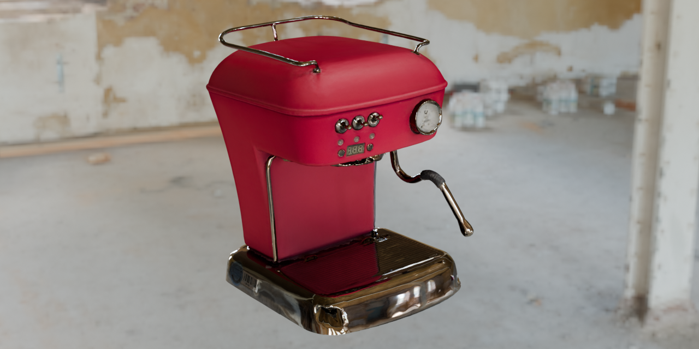
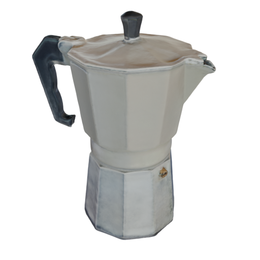
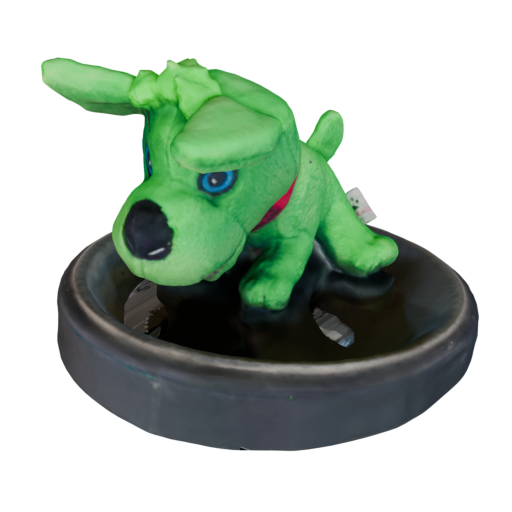
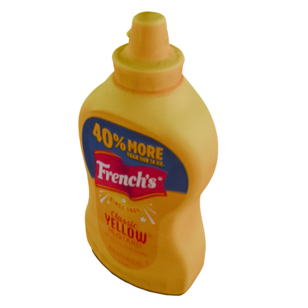
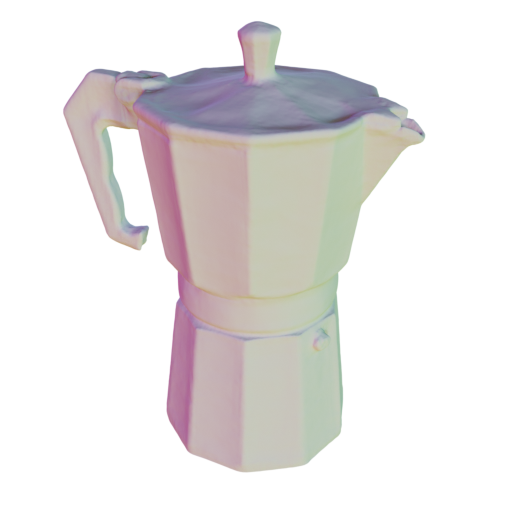
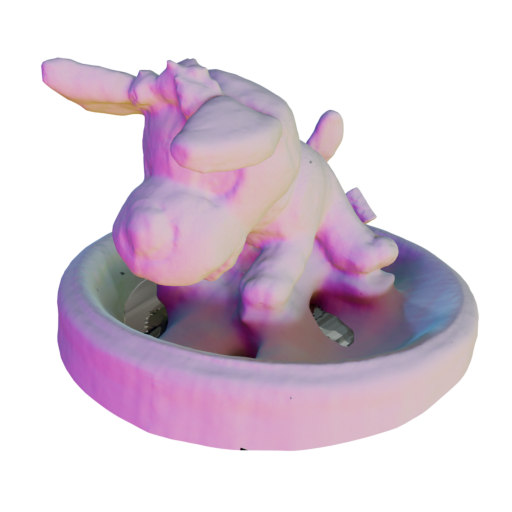
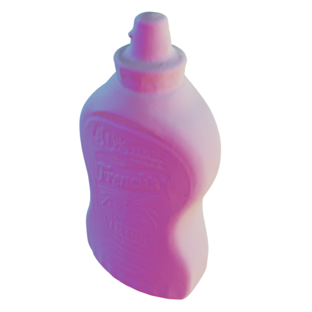

# mini-mesh

Create detailed, textured 3D meshes of anything from a short smartphone video.



|                                   |                               |                                       |
|:---------------------------------:|:-----------------------------:|:-------------------------------------:|
|  |  |  |
|  |  |  |

_Head over to the repository's [**GitHub** Pages site](https://hummat.github.io/mini-mesh) for a prettier and more
interactive version of this README!_

## Quick Start

Requires [Docker](https://docs.docker.com/get-docker), an NVIDIA GPU with 12GB+ VRAM (6GB minimum), and the [NVIDIA Container Toolkit](https://docs.nvidia.com/datacenter/cloud-native/container-toolkit/latest/install-guide.html).

```bash
docker/run.sh /path/to/your/video/or/images
```

This uses a Docker image and runs the full pipeline through the checked-out
repository wrapper. Add `--help` for options.

## Installation

### Docker (recommended)

<details markdown="1">
<summary><strong>Setup instructions</strong></summary>

1. Install [Docker](https://docs.docker.com/get-docker)
2. Start and enable the Docker service:

    ```bash
    sudo systemctl start docker
    sudo systemctl enable docker
    ```

3. Install the [NVIDIA Container Toolkit](https://docs.nvidia.com/datacenter/cloud-native/container-toolkit/latest/install-guide.html)
4. Configure the Docker runtime and restart:

    ```bash
    sudo nvidia-ctk runtime configure --runtime=docker
    sudo systemctl restart docker
    ```

</details>

<details markdown="1">
<summary><strong>Image variants</strong></summary>

| Image | Size | Use when |
|-------|------|----------|
| `hummat/mini-mesh:latest` | ~11.6GB | Default — includes all features |
| `hummat/mini-mesh:slim` | ~9GB | Limited VRAM or disk space (no rembg, nerfstudio, sam2, hloc, vggsfm) |

The full image prebuilds CUDA wheels for `nvdiffrast` and `gsplat`, so texture baking and
nerfstudio Gaussian splatting methods do not compile CUDA extensions at runtime.

Also available on GitHub Container Registry: `ghcr.io/hummat/mini-mesh`

To use slim:
```bash
docker pull hummat/mini-mesh:slim
MINI_MESH_IMAGE=hummat/mini-mesh:slim docker/run.sh /path/to/input
```

The wrappers use `hummat/mini-mesh:latest` unless `MINI_MESH_IMAGE` is set. To
run a locally built image, use `MINI_MESH_USE_LOCAL_IMAGE=1`.

</details>

<details markdown="1">
<summary><strong>Building custom images</strong></summary>

The pre-built image includes native CUDA code for compute capabilities 7.5, 8.0,
8.6, and 8.9, plus PyTorch-extension PTX for 8.9.

```bash
docker/build.sh local  # Build optimized for your GPU
```

See [CONTRIBUTING.md](/.github/CONTRIBUTING.md#docker) for build variants and options.

**RTX 50XX (Blackwell):** not a native target in the published image. The PTX
fallback may work with a new enough driver, but the reliable path is a custom
CUDA/PyTorch stack with native Blackwell support.

</details>

### Manual Installation

<details markdown="1">
<summary><strong>Full manual setup</strong></summary>

Requirements: Python 3.11, CUDA 12.4.1, COLMAP, GLOMAP, uv

This repository includes a local setup helper for the Web UI's `local` mode. It uses
the active CUDA build environment, builds pinned PoseLib/COLMAP/GLOMAP into
`.local/mini-mesh`, and installs the Python/CUDA stack into `.venv`.

```bash
cp .envrc.example .envrc
# edit .envrc for your CUDA/GCC paths and GPU architecture
direnv allow
make build
uv run python webui.py
```

Manual setup requires:

- Python 3.11 or 3.12 via uv
- CUDA Toolkit 12.4.x in `CUDA_HOME`
- GCC/G++ 12 for CUDA extension builds
- System C++ headers/libraries for COLMAP/GLOMAP
- `CUDA_HOME`, `CC`, `CXX`, `CUDAHOSTCXX`, `TORCH_CUDA_ARCH_LIST`, and `MAX_JOBS`
  exported in `.envrc` or in the shell running `make build`
- Optional PyTorch-extension PTX fallback via `TORCH_CUDA_ARCH_LIST=8.9+PTX`

</details>

<details markdown="1">
<summary><strong>Optional dependencies</strong></summary>

`make build` installs the local optional stack used by Web UI `local` mode:
nerfstudio, Splatfacto-W, rembg, SAM2, VGGSfM, HLoc, tiny-cuda-nn,
nvdiffrast, and gsplat.
The CUDA extension sources are pinned to the same refs as the Docker image.

For custom environments, install from the pinned refs used by `scripts/build.sh`
and `pyproject.toml` instead of upstream HEAD. For example:

```bash
# NeRF/splat models
uv pip install git+https://github.com/hummat/nerfstudio.git@55a1f83025bb28cbf792760c9b79f9eb22c3a2e4
uv pip install git+https://github.com/KevinXu02/splatfacto-w.git@119a3bfb3aa03669278e174ff11c4dfdcbcf97d7

# Background masking
uv pip install "rembg[gpu,cli]==2.0.69"
uv pip install git+https://github.com/hummat/sam2.git@98f488a540f87260b8e51146dc3ab15694dd174c

# Advanced SfM (HLoc) - requires manual clone
git clone --recursive https://github.com/cvg/Hierarchical-Localization.git
cd Hierarchical-Localization && git checkout 3bdf494c852f157db57a1cf2039a6c826d52e702
git submodule update --init --recursive && uv pip install -e . && cd ..
uv pip install git+https://github.com/hummat/hloc-cli.git@1b714e1183bbc3cb6f4031ddedcc4bd5190ece29

# Advanced SfM (VGGSfM)
uv pip install git+https://github.com/hummat/vggsfm.git@d597df629a312a662544006ac3bdbc2782b82834

# GPU texture baking (nvdiffrast) - requires CUDA toolkit
uv pip install --no-build-isolation git+https://github.com/NVlabs/nvdiffrast.git@253ac4fcea7de5f396371124af597e6cc957bfae
```

</details>

## Usage

```bash
# Docker
docker/run.sh /path/to/your/video/or/images

# Manual/local
scripts/run.sh /path/to/your/video/or/images

# Local Web UI
uv run python webui.py
```

The pipeline runs 5 steps: **video** → **sfm** → **process** → **train** → **export**

By default, the runner chooses SfM from the number of images it will process:
up to 150 images use COLMAP exhaustive matching, 151-500 images use GLOMAP
exhaustive matching, and video inputs with more than 500 extracted frames use
GLOMAP sequential matching. Large image-directory inputs stay on GLOMAP
exhaustive matching unless you pass `sfm --matcher sequential`. Training defaults
to `neus-facto` with `neus-facto-short`, which is the default mini-mesh mesh path
for typical handheld captures.

The Web UI is a local single-user launcher for the same pipeline contract. It
builds the command, starts one active run, streams the combined log, supports
stopping the child process, shows stage progress, and previews discovered mesh
artifacts with the built-in 3D viewer.

Pass arguments to specific steps using sub-commands:

```bash
docker/run.sh /path/to/input video --fps 1 sfm --method glomap process --mask rembg train --model neus-facto
```

Use `video --frames <N>` instead of `--fps` when you want a fixed frame budget
sampled across the whole video or `--time_slice`. Use `video --max-frames <N>`
to keep the requested FPS unless it would exceed that frame budget.

The final mesh appears next to your input. Steps already completed are skipped
(use `--overwrite` to re-run).

Interrupted training can be resumed without deleting checkpoints:

```bash
docker/run.sh /path/to/input train --model neus-facto --config neus-facto-short --name my-run --resume
```

Use `--resume-step <step>` to load a specific checkpoint. Resume uses
`sdfstudio_models/` for SDF models and `nerfstudio_models/` for NeRF/splat
models; it fails if no checkpoint is present instead of silently starting over.

### Batch processing

Use `scripts/batch.sh` to run the same pipeline over every top-level video in a
directory, or over an explicit list of videos. It creates one work directory per
video stem and stages the video there, so outputs do not collide.

```bash
scripts/batch.sh /path/to/videos -- \
  video --fps 4 \
  train --model splatfacto-mcmc --config splatfacto-mcmc-short --name sfmcmc --vis viewer \
  export --obb-scale 1.5 1.5 1.0
```

The default runner is Docker. Use `--runner local` for a local install, or
`--copy` when hardlinks are not possible across filesystems. For explicit video
lists from different parent directories, pass `--work-root`. Batch runs are
sequential and stop on the first failed video.

### Multiple videos of one scene

Use `scripts/scene.sh` when several videos show the same scene and should feed
one reconstruction. It extracts all videos into one shared `images/` directory
with collision-proof frame names, writes `.mini-mesh/frame_sources.tsv`, then
runs the normal pipeline once on that image scene.

```bash
scripts/scene.sh --runner docker --work-dir /path/to/scene \
  /path/to/video1.mp4 /path/to/video2.mp4 -- \
  video --fps 4 \
  sfm --method glomap process --mask rembg \
  train --model splatfacto-mcmc --config splatfacto-mcmc-short --name sfmcmc \
  export --obb-scale 1.5 1.5 1.0
```

The optional `video ...` context is used only for frame extraction and is not
forwarded to `run.sh`. Use `--overwrite` before `--` to rebuild the assembled
frames and rerun the downstream pipeline with overwrite enabled. If the videos
come from different cameras or zoom settings, pass `sfm --camera_model ...`
carefully; the default SfM path assumes one shared camera.

### Docker wrapper options

`docker/run.sh` and `docker/start.sh` mount your input directory at `/data` and,
by default, mount the current checkout at `/app` so the container runs the same
scripts you have locally.

Environment variables:

| Variable | Default | Purpose |
|----------|---------|---------|
| `MINI_MESH_IMAGE` | `hummat/mini-mesh:latest` | Docker image to run |
| `MINI_MESH_USE_LOCAL_IMAGE` | `off` | Use `hummat/mini-mesh:local`; fails if the image is missing |
| `MINI_MESH_DOCKER_APP` | `repo` | `repo` runs `/app/scripts/run.sh`; `image` runs the baked `/opt/mini-mesh/scripts/run.sh` |
| `MINI_MESH_DOCKER_TTY` | `auto` for `run.sh`; `on` for `start.sh` without a command; otherwise `auto` | `auto`, `on`, or `off` |
| `MINI_MESH_DOCKER_X11` | `auto` | `auto`, `on`, or `off` for COLMAP GUI/X11 forwarding |
| `MINI_MESH_DOCKER_PORT` | `7007` | Host port mapped to container port `7007`; use `none` to disable |

Use the baked scripts in the image for release smoke tests:

```bash
MINI_MESH_DOCKER_APP=image docker/run.sh /path/to/input video --fps 1
```

### Models

| Model | Description |
|-------|-------------|
| `neus` | Plain NeuS baseline for debugging/tuning |
| `neus-facto` | Default faster surface reconstruction (recommended) |
| `neuralangelo` | Higher quality via multi-resolution features, slower |
| `nerfacto` | View synthesis, not watertight meshes (requires nerfstudio) |
| `splatfacto` | Fast view synthesis via point clouds (requires nerfstudio) |
| `splatfacto-w-light` | Splatfacto-W variant compatible with mini-mesh/Nerfstudio data |

Full `splatfacto-w` is intentionally not exposed: it expects the plugin's
Phototourism/Nerf-W dataparser and dataset layout, not mini-mesh's processed
`transforms.json` data.

**Config suffixes:** `-test` (3K iters), `-min` (7K), `-short` (10-30K), (none) (100K), `-long` (200K+)

**Capacity:** `-small`, (none), `-large` — e.g. `neus-facto-small-short`

<details markdown="1">
<summary><strong>Export methods</strong></summary>

**SDF models** (automatic): Extracts mesh → creates texture coordinates → bakes colors onto texture → simplifies geometry

**Export method selector** (`export --method <name>`):
- `poisson` — Reconstructs smooth surface from rendered point cloud (default)
- `tsdf` — Fuses depth maps into a volume, then extracts mesh
- `pointcloud` — Export as point cloud (no mesh)
- `orbit-frames` — Render a spiral RGB image sequence to `orbit_frames/` for frame-snapping web/blog viewers
- Gaussian splats are automatic for splatfacto models; `splatfacto-w-light` bakes its mean appearance embedding by
  default and uses classic rasterization plus denser splatfacto-style culling/splitting thresholds for portable PLY
  output. Use `export --appearance-mode index --appearance-idx <N>` to bake a specific training image appearance.

For NeRF/ngp models, request several exporters by repeating `--method` or using
a comma-separated value, for example `export --method poisson,orbit-frames`. For SDF and splat models,
`orbit-frames` is additive to the normal export.

</details>

<details markdown="1">
<summary><strong>Process options</strong></summary>

- `--mask <method>` — Background masking: `rembg`, `sam2`, `true`, `none`
- `--min-match-ratio <float>` — Fail if fewer than this fraction of images get poses (default: 0.5)
- `--crop-factor <top bot left right>` — Crop images before processing

</details>

<details markdown="1">
<summary><strong>Visualization</strong></summary>

**TensorBoard (default):**
```bash
docker/run.sh video.mp4 train --vis tensorboard
tensorboard --logdir /path/to/your/data  # on host
```

**Weights & Biases:**
```bash
export WANDB_API_KEY=your_api_key  # add to ~/.bashrc
docker/run.sh video.mp4 train --vis wandb
```

**Web Viewer:** Automatically configured for nerfstudio's real-time 3D viewer.

</details>

<details markdown="1">
<summary><strong>Artist-in-the-loop workflow</strong></summary>

1. Run pipeline up to mesh extraction only:

   ```bash
   docker/run.sh /path/to/input video --fps 2 sfm --method glomap process --mask rembg train --model neus-facto --config neus-facto export --mesh-only
   ```

2. Edit `train/<name>/<model>/run/mesh.ply` in Blender (don't change global transform)

3. Run texturing only:

   ```bash
   docker/run.sh /path/to/input export --texture-only
   # Or with edited mesh:
   docker/run.sh /path/to/input export --texture-only --input-mesh-filename mesh_edited.ply
   ```

4. **(Optional) Optimize for web delivery:**

   The exported GLB files are ~10MB due to uncompressed geometry and PNG textures. For web use (e.g., `<model-viewer>`), compress with [gltf-transform](https://gltf-transform.dev/):

   ```bash
   npx @gltf-transform/cli optimize mesh.glb mesh_web.glb --compress draco --texture-compress webp
   ```

   This typically achieves **90-95% size reduction** (10MB → 500KB-1MB) by:
   - **Welding vertices**: Blender's GLB export duplicates vertices at UV seams; `optimize` merges them back
   - **Draco compression**: Quantizes geometry to 14-bit precision + entropy coding
   - **WebP textures**: Lossy compression, visually identical to PNG at ~10% the size

   The mesh quality is preserved—the bloat comes from export artifacts, not your edits.

<details markdown="1">
<summary>Without Docker</summary>

```bash
# Step 1: Extract mesh only
scripts/run.sh /path/to/input \
  video --fps 2 sfm --method glomap process --mask rembg train --model neus-facto --config neus-facto export --mesh-only

# Step 3: Texture only (after editing mesh)
scripts/export.sh /path/to/data/train/<name>/<model>/run --texture-only
# Or with edited mesh:
scripts/export.sh /path/to/data/train/<name>/<model>/run --texture-only --input-mesh-filename mesh_edited.ply
```

</details>

</details>

## Troubleshooting

Common issues and solutions:

| Problem | Quick fix |
|---------|-----------|
| Bad results | Improve input: 30-120s video, good lighting, cover all angles |
| CUDA OOM | Reduce ray batch sizes; for full-image or 4K training, use `--downscale-factor 2` or higher |
| Few SfM poses | Try `--matcher exhaustive`, `--method glomap`, or `--method hloc` |
| Training diverges | Check dataparser near/far logs; SDF defaults auto-derive bounds, but explicit `near-plane`/`far-plane` still override |
| Wrong mesh scale | Adjust `--scale-factor` (default 2.5) |

For advanced tuning (BRDF flags, regularizers, NeuS parameters), see **[docs/troubleshooting.md](docs/troubleshooting.md)**.

## Documentation

- **[Troubleshooting](docs/troubleshooting.md)** — Common issues and advanced tuning
- **[Methods & Models](docs/methods_and_models.md)** — How NeuS, NeRF, and other methods work
- **[BRDF & Shading](docs/brdf_and_shading_effects.md)** — Handling reflective and glossy surfaces
- **[Examples](docs/examples.md)** — Additional usage examples

## Demos

Visit the [GitHub Pages site](https://hummat.github.io/mini-mesh) for:

- **Interactive 3D meshes** — rotate, zoom, and inspect reconstructed models in your browser
- **2D/3D gallery toggle** — compare rendered colors with normal maps
- **Video overlay** — see the input capture process

## References

1. [NeuS: Learning Neural Implicit Surfaces by Volume Rendering](https://arxiv.org/abs/2106.10689)
2. [Ref-NeRF: Structured View-Dependent Appearance](https://arxiv.org/abs/2112.03907)
3. [Instant NGP: Multiresolution Hash Encoding](https://arxiv.org/abs/2201.05989)
4. [Neuralangelo: High-Fidelity Neural Surface Reconstruction](https://arxiv.org/abs/2306.03092)
5. [Mip-NeRF 360: Unbounded Anti-Aliased NeRF](https://arxiv.org/abs/2111.12077)

## Dependencies

mini-mesh builds on several open-source projects. We maintain active forks of
libraries where upstream is stale or we need faster iteration.

| Component | Upstream | Fork | Role |
|-----------|----------|------|------|
| **SDFStudio** | [autonomousvision/sdfstudio](https://github.com/autonomousvision/sdfstudio) | [hummat/sdfstudio](https://github.com/hummat/sdfstudio) | NeuS/VolSDF surface reconstruction, mesh extraction, texture baking. Fork modernizes PyTorch, adds RTX 40XX support and PBR export fixes. |
| **nerfstudio** | [nerfstudio-project/nerfstudio](https://github.com/nerfstudio-project/nerfstudio) | [hummat/nerfstudio](https://github.com/hummat/nerfstudio) | NeRF and Gaussian splatting training + export. Fork fixes deprecated PyTorch imports. |
| **SAM 2** | [facebookresearch/sam2](https://github.com/facebookresearch/sam2) | [hummat/sam2](https://github.com/hummat/sam2) | Interactive segmentation for background masking. Fork adds a full CLI (upstream has none). |
| **VGGSfM** | [facebookresearch/vggsfm](https://github.com/facebookresearch/vggsfm) | [hummat/vggsfm](https://github.com/hummat/vggsfm) | Deep-learning SfM. Fork makes it pip-installable and fixes CUDA compatibility. |
| **HLoc CLI** | — | [hummat/hloc-cli](https://github.com/hummat/hloc-cli) | CLI wrapper for [Hierarchical-Localization](https://github.com/cvg/Hierarchical-Localization) deep-learning SfM. |
| **COLMAP** | [colmap/colmap](https://github.com/colmap/colmap) | — | Classical SfM (feature extraction, matching, mapping) |
| **GLOMAP** | [colmap/glomap](https://github.com/colmap/glomap) | — | Global SfM mapper (faster alternative to COLMAP's incremental mapper) |
| **nvdiffrast** | [NVlabs/nvdiffrast](https://github.com/NVlabs/nvdiffrast) | — | GPU-accelerated rasterization for texture baking |
